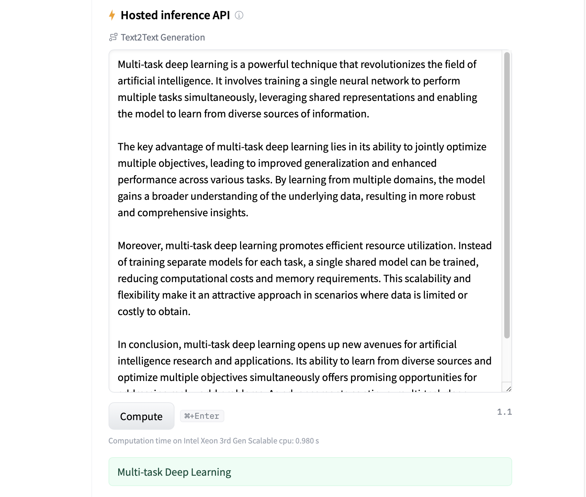

# Text-2-Title: A T5-Based Headline Generator

## Overview

A running version of the model is [hosted on Huggingface](https://huggingface.co/EdBianchi/T5-finetuned-abstracts).

Collection of Jupyter Notebooks focusing on the fine-tuning of T5 for text summarization and title generation. The idea is to generate a summary short enough to be a possible title. A version of the fine-tuned model is hosted on Huggingface and can be tested directly from the browser (hosted inference API). The fine-tuned model can be downloaded and used through the Huggingface API.

## Model Card

This model is a fine-tuned version of [t5-small](https://huggingface.co/t5-small) on [CShorten/ML-ArXiv-Papers](https://huggingface.co/datasets/CShorten/ML-ArXiv-Papers).

It achieves the following results on the evaluation set:
- Train Loss: 1.9469
- Train Lr: 0.0004
- Validation Loss: 1.8462
- Validation Lr: 0.0002

## Training procedure

### Training hyperparameters

The following hyperparameters were used during training:
- optimizer: {'name': 'Adam', 'learning_rate': 0.00015378147, 'decay': 0.0, 'beta_1': 0.9, 'beta_2': 0.999, 'epsilon': 1e-07, 'amsgrad': False}
- training_precision: float32

### Training results

| Train Loss | Train Lr | Validation Loss | Validation Lr | Epoch |
|:----------:|:--------:|:---------------:|:-------------:|:-----:|
| 2.2534     | 0.0005   | 1.9839          | 0.0007        | 0     |
| 1.9469     | 0.0004   | 1.8462          | 0.0002        | 1     |

### Framework versions

- Transformers 4.21.3
- TensorFlow 2.10.0
- Datasets 2.4.0
- Tokenizers 0.12.1

